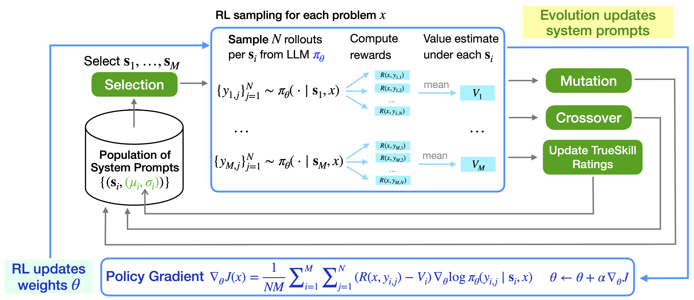
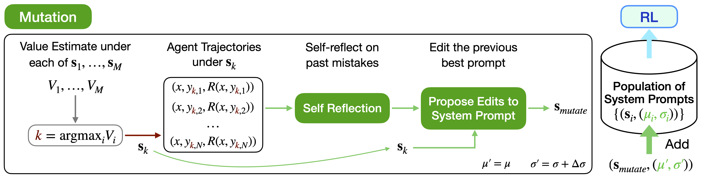
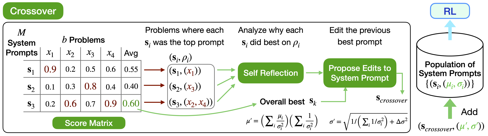
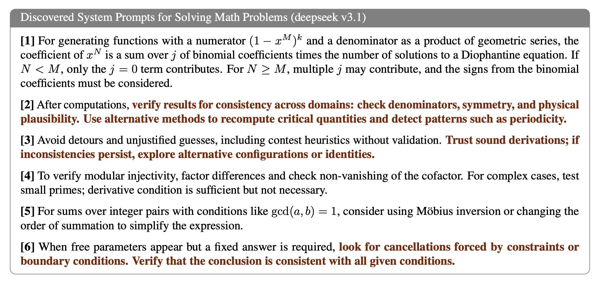

<h2 align="center">
Evolutionary System Prompt Learning for Reinforcement Learning in LLMs
</h2>

<p align="center">
Anonymous Authors
</p>

## TL;DR

LLMs today primarily self-improve via two mechanisms: *self-reflection* for context updates, and *reinforcement learning* (RL) for weight updates. We propose **Evolutionary System Prompt Learning** (**E-SPL**), a method for jointly improving model contexts and model weights. In each **RL** iteration, we sample trajectories under multiple system prompts and do policy gradients accordingly. At the same time, we apply evolutionary updates to system prompts via mutation and crossover, **two genetic operators based on LLM self-reflection**. Coupling RL with system prompt evolution yields consistent gains in sample efficiency and generalization.

## Table of Contents

- [Overview of E-SPL](#overview-of-e-spl)
- [Genetic Operators](#genetic-operators)
- [Quick Start](#quick-start)
- [Design](#design)
- [Experiments](#experiments)
- [Example System Prompt](#example-of-discovered-system-prompts)
- [Citation](#citation)
- [License](#license)

## Overview of E-SPL



Evolutionary System Prompt Learning (E-SPL) jointly optimizes model contexts and model weights to enhance LLM
self-improvement. Evolution updates system prompts; RL updates model weights.

The learned system prompts can encode **declarative knowledge** (factual information or global heuristics that can be verbally explained) via articulated principles and strategies, while RL gradients can further hone the model’s **procedural knowledge** (practical, instinctive "know-how" that relies on intuition developed through repetition) for reliable execution.

## Genetic Operators



**Mutation operator** in E-SPL. The highest-performing prompt in each iteration undergoes LLM self-reflection on group-wise agent trajectories and their outcomes. An LLM-generated diff edits the parent into a child system prompt, removing ineffective rules and converting observed mistakes into improved declarative instructions, yielding a new prompt that enters the evolutionary population.



**Crossover operator** in E-SPL. System prompts are compared based on their problem-wise performance within the current RL batch. Guided by these differential strengths and weaknesses, an LLM self-reflection process selectively recombines the most effective complementary segments from multiple parent prompts, yielding a new child prompt that enters the evolutionary population.

## Quick Start

1. Create a Tinker API key from the [console](https://tinker-console.thinkingmachines.ai) and export it as environment variable `TINKER_API_KEY`.
2. Install tinker python client via `pip install tinker`
3. Install `tinker-cookbook` in a virtual env either with `conda` or `uv`; for a quick start, `pip install -e .`.

### Environment Setup

```bash
conda env create -f environment.yml
conda activate spl
```

### Tinker

Refer to the [docs](https://tinker-docs.thinkingmachines.ai/training-sampling) to start from basics.
A few basic Tinker primitives are shown below:

```python
service_client = tinker.ServiceClient()
training_client = service_client.create_lora_training_client(
  base_model="meta-llama/Llama-3.2-1B", rank=32,
)
training_client.forward_backward(...)
training_client.optim_step(...)
training_client.save_state(...)
training_client.load_state(...)

sampling_client = training_client.save_weights_and_get_sampling_client(name="my_model")
sampling_client.sample(...)
```

To download the weights of any model:
```python
rest_client = service_client.create_rest_client()
future = rest_client.download_checkpoint_archive_from_tinker_path(sampling_client.model_path)
with open(f"model-checkpoint.tar.gz", "wb") as f:
    f.write(future.result())
```

## Design

### Program

Each candidate system prompt in the evolutionary pool is represented as a `Program` object (defined in `tinker_cookbook/recipes/system_prompt_learning_rl.py`).

| Attribute | Type | Description |
|---|---|---|
| `principles` | `dict` | The system prompt content (mapping of index → principle text) |
| `program_id` | `int` | Unique identifier |
| `rating` | `Rating` | TrueSkill rating tracking quality and uncertainty |
| `past_score_history` | `list` | History of evaluation scores |
| `self_modified_from` | `int` | Parent program ID if created by mutation (`-1` for root) |
| `parents_list` | `list \| None` | Parent program IDs if created by crossover |
| `timestep` | `int \| None` | Generation when this program was created |

Programs are managed in an `EvolutionPool` that handles FIFO eviction (up to `max_pool_size`), selection, and lineage tracking.

### TrueSkill Rating

Program quality is tracked via a TrueSkill Bayesian rating system (implemented in `tinker_cookbook/recipes/trueskill_utils.py`).

- Each `Program` carries a `Rating(mu, sigma)` — `mu` is mean skill (default 25.0), `sigma` is uncertainty (default ~8.33).
- After each RL batch, programs are ranked by problem-wise performance and ratings are updated via `rate_1v1()` or `rate_ranking()`.
- The `program_selection_strategy` config parameter controls how ratings guide selection: `"uniform"` ignores ratings, `"lucb"` / `"ucb"` use confidence bounds, `"softmax"` samples proportionally.

## Experiments

All experiments are run via a single entry-point script and configured with CLI kwargs (powered by `chz`):

```bash
python tinker_cookbook/recipes/system_prompt_learning_rl.py <key>=<value> ...
```

### Training Modes (`train_mode`)

| `train_mode` | Description |
|---|---|
| `"evolution_rl"` | Joint evolution + RL — the full **E-SPL** method (default) |
| `"evolution"` | System-prompt evolution only (no weight updates) |
| `"rl"` | RL only (no system-prompt evolution) |

### Dataset Pairs (`dataset_pair`)

Four pre-configured train → test splits are available:

| `dataset_pair` | Train set | Test set |
|---|---|---|
| `"aimo_beyondaime"` (default) | aimo-validation-aime | BeyondAIME |
| `"dapo_aime25"` | DAPO-Math-17k | AIME25 |
| `"aime_and_amc_to_beyondaime"` | aime_and_amc | BeyondAIME |
| `"hmmt"` | hmmt_train (2023–2025) | hmmt_nov_2025 |

### Key Configuration Parameters

**RL**

| Parameter | Default | Description |
|---|---|---|
| `n_epochs` | `10` | Number of training epochs |
| `batch_size` | `10` | Problems per RL batch |
| `group_size` | `5` | Samples per problem for advantage estimation |
| `learning_rate` | `4e-5` | Optimizer learning rate |
| `lora_rank` | `32` | LoRA rank for parameter-efficient fine-tuning |
| `max_tokens` | `15000` | Maximum generation length (tokens) |
| `sampling_temperature` | `0.7` | Sampling temperature |
| `rl_loss_fn` | `"importance_sampling"` | RL loss function |
| `value_baseline_computation` | `"normal"` | Advantage baseline: `"normal"` (per-program) or `"marginalize"` (across programs) |

**Evolution**

| Parameter | Default | Description |
|---|---|---|
| `max_pool_size` | `100` | Maximum number of prompts in the evolution pool |
| `max_update_operations` | `2` | Maximum number of mutation operations (modify/add) per principle update |
| `choose_from_most_recent` | `5` | Number of recent prompts considered for selection |
| `num_parallel_programs` | `3` | Prompts evaluated in parallel each iteration |
| `crossover_prob` | `0.0` | Probability of applying the crossover operator (vs. mutation) |
| `program_selection_strategy` | `"uniform"` | Prompt selection strategy (`"uniform"`, `"lucb"`, `"ucb"`, or `"softmax"`) |
| `mutation_sigma` | `1.0` | Controls mutation intensity |
| `crossover_sigma` | `1.0` | Controls crossover intensity |
| `evolution_sample_client` | `"reference"` | Model used for evolution sampling (`"reference"` or `"current"`) |

**General**

| Parameter | Default | Description |
|---|---|---|
| `model_name` | `"deepseek-ai/DeepSeek-V3.1"` | Base model identifier |
| `log_path` | `"/tmp/tinker-examples/system_prompt_learning_rl"` | Output log directory |
| `experiment_name` | `"system_prompt_learning_rl"` | Experiment identifier (also used as W&B run name) |
| `save_every` | `20` | Save a checkpoint every N iterations |

### Example Commands

**E-SPL with Mutation + Crossover** — uses `crossover_prob=0.2` and `program_selection_strategy="lucb"` for bandit-based prompt selection:
```bash
python tinker_cookbook/recipes/system_prompt_learning_rl.py \
  experiment_name="aimo_beyondaime" \
  log_path="/tmp/tinker-examples/aimo_beyondaime" \
  max_update_operations=2 value_baseline_computation="normal" \
  max_pool_size=200 choose_from_most_recent=10 num_parallel_programs=3 \
  train_mode="evolution_rl" evolution_sample_client="reference" \
  crossover_prob=0.2 program_selection_strategy="lucb" \
  dataset_pair="aimo_beyondaime" sampling_temperature=0.6
```

**E-SPL with Mutation only** — disables crossover (`crossover_prob=0.0`) and uses uniform prompt selection:
```bash
python tinker_cookbook/recipes/system_prompt_learning_rl.py \
  experiment_name="aimo_beyondaime" \
  log_path="/tmp/tinker-examples/aimo_beyondaime" \
  max_update_operations=2 value_baseline_computation="normal" \
  max_pool_size=200 choose_from_most_recent=10 num_parallel_programs=3 \
  train_mode="evolution_rl" evolution_sample_client="reference" \
  crossover_prob=0.0 program_selection_strategy="uniform" \
  dataset_pair="aimo_beyondaime" sampling_temperature=0.6
```

### Output Structure

A training run produces the following directory layout:

```
data/math/train/{experiment_name}/
├── stats.json                        # Per-step metrics
├── epoch_{N}/
│   └── shuffled_data.jsonl           # Epoch-specific shuffle
└── step_{N}/
    ├── test_rollout.jsonl            # Test set rollouts
    ├── evolution_pool.json           # Full evolutionary pool snapshot
    ├── evolved_principles.json       # Mutation result
    ├── crossover_result.json         # Crossover result (if triggered)
    └── sampled_program_{K}/
        ├── principles_to_mutate.json # Principles used for this program
        └── rollout.jsonl             # Training rollouts
```

## Example of Discovered System Prompts



Discovered strategies in learned system prompts for solving math problems include: useful heuristics and tips for various categories of problems, self-verification strategies such as checking for consistency and plausibility, a list of common failure modes to avoid, etc. E-SPL can effectively codify declarative knowledge into the system prompt - specialized domain expertise and helpful problem-solving heuristics under various circumstances - so that RL can focus on honing core reasoning skills rather than memorizing domain knowledge.

## Citation
If you find our work to be useful, consider citing us:

```bibtex
@article{e-spl,
  title={Evolutionary System Prompt Learning for Reinforcement Learning in LLMs},
  author={Anonymous},
  year={2026}
}
```

## License

This project is licensed under the MIT License.
